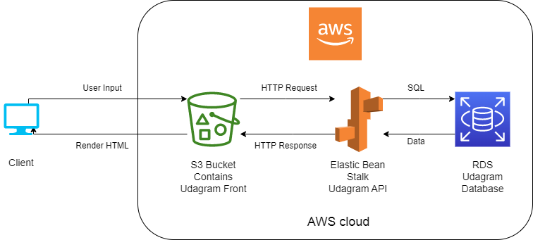

# Infrastructure Description

The following image demonstrate the project infrastructure:  
 
 

The enduser will use any brwoser to open the application [URL](http://udagram-frontend-bucket.s3-website-us-east-1.amazonaws.com)

we uses three AWS cloud sevices to host our fronend and API application as follow:  

- AWS S3 Bucket: web hosting enabled bucket that contains the frontend application wchich is angular app  

- AWS Elastic Beanstalk: for hosting our backend application "udagram-api" inside an environment  
the config.yml file in the .elasticbeanstalk has the environment initialization details  

- AWS RDS: we create a postgres database to host the backend API data (users, feeditems).

the brwoser send the input to the cloud to process the request and it will render the response comes from the cloud

the S3 receives the user input ex:register form and send and HTTP request to the backend API with the data in the form then the backend do the necessary process like creating hashing for the password or verviey jwt token and then send a SQL query - update to the RDS database, the database will store - retrive the data and send it back to the API app then the API will send HTTP response to the frontend which will send it to the client "brwoser" to render the response.